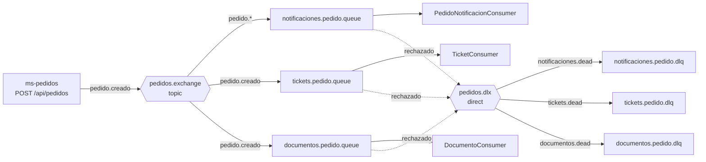

# Pedidos360

Sistema de pedidos con arquitectura de microservicios (Java 17 + Spring Boot) y frontend Angular.
Autenticación con Azure AD (IDaaS) y mensajería asíncrona con **RabbitMQ** (Evaluación Parcial N°2, DSY1107).

## Arquitectura

| Componente | Puerto | Rol |
|---|---|---|
| `frontend` (Angular) | 4200 | Login con Azure AD y consumo de las APIs con el JWT |
| `ms-productos` | 8082 | Catálogo de productos |
| `ms-pedidos` | 8081 | Crea pedidos y **publica** eventos en RabbitMQ |
| `ms-clientes` | 8084 | Gestión de clientes |
| `ms-notificaciones` | 8083 | **Consume** eventos: genera notificaciones, tickets y documentos |
| `ms-rabbit-admin` | 8085 | Administración de colas, exchanges y bindings vía REST |

Todos los microservicios validan el JWT emitido por Azure AD (filtro de Spring Security + validador de audience).

## Flujo de mensajería



| Elemento | Nombre | Definido en |
|---|---|---|
| Exchange de eventos | `pedidos.exchange` (topic) | `application.yml` de ms-pedidos y ms-notificaciones |
| Exchange de mensajes muertos | `pedidos.dlx` (direct) | `application.yml` de ms-notificaciones |
| Colas | `notificaciones.pedido.queue`, `tickets.pedido.queue`, `documentos.pedido.queue` (quorum) | `application.yml` de ms-notificaciones |
| DLQ | `notificaciones.pedido.dlq`, `tickets.pedido.dlq`, `documentos.pedido.dlq` | `application.yml` de ms-notificaciones |
| Routing keys | `pedido.creado`, `pedido.cancelado`, `pedido.*`, `notificaciones.dead`, `tickets.dead`, `documentos.dead` | `application.yml` |

Los beans `Queue`, `Exchange` y `Binding` están en clases `@Configuration` separadas de la lógica de negocio
(`NotificacionesRabbitConfig`, `TicketsRabbitConfig`, `DocumentosRabbitConfig`, `RabbitCommonConfig`, `RabbitMQConfig`).

### Política de errores en los consumidores

Los consumidores usan ACK manual. La política es única y está en `ConsumerErrorHandler`:

| Situación | Acción |
|---|---|
| Procesado correctamente | `ACK` |
| Dato inválido (`IllegalArgumentException`, p. ej. `clienteEmail` vacío) | `NACK` sin reencolar, va a la **DLQ** |
| Error recuperable, primera vez | `NACK` con reencolado (un reintento) |
| Error recuperable, mensaje ya reentregado | `NACK` sin reencolar, va a la **DLQ** |

Cada decisión queda registrada en el log. El `DeadLetterConsumer` (opcional, ver más abajo) registra además cada mensaje que llega a cualquiera de las tres DLQ.

Si RabbitMQ no está disponible, `ms-pedidos` igual guarda el pedido: el fallo de publicación se registra en el log y no interrumpe la operación.

## Requisitos

- Java 17 o superior
- Node.js y npm (frontend)
- MySQL accesible (cada microservicio usa su propia base)
- RabbitMQ con plugin de management (puertos 5672 y 15672)

## Variables de entorno

| Variable | Usada por | Descripción | Valor por defecto |
|---|---|---|---|
| `RABBITMQ_ADDRESSES` | pedidos, notificaciones, admin | `host:puerto` del broker | `localhost:5672` |
| `RABBITMQ_USER` / `RABBITMQ_PASS` | pedidos, notificaciones, admin | Credenciales de RabbitMQ | `guest` / `guest` |
| `RABBITMQ_MGMT_HOST` | admin | Host de la API de management (puerto 15672) | `localhost` |
| `DB_URL` | microservicios con BD | URL JDBC base | `jdbc:mysql://localhost:3306/<bd>` |
| `DB_PASSWORD` | microservicios con BD | Contraseña del usuario de BD | (obligatoria) |
| `DLQ_LISTENER_ENABLED` | notificaciones | `true` registra y vacía las DLQ | `false` |

No se suben credenciales al repositorio: se pasan por variables de entorno.

## Cómo ejecutar

En PowerShell, reemplazando `<IP_EC2>` por la dirección de RabbitMQ:

```powershell
$env:RABBITMQ_ADDRESSES = '<IP_EC2>:5672'
$env:RABBITMQ_MGMT_HOST = '<IP_EC2>'
$env:RABBITMQ_USER = '<usuario>'
$env:RABBITMQ_PASS = '<password>'
$env:DB_PASSWORD   = '<password-bd>'
```

Levantar **en este orden**, cada uno en su terminal con las variables anteriores:

```powershell
cd backend\ms-notificaciones ; .\mvnw spring-boot:run   # 1ro: declara colas, exchanges y bindings
cd backend\ms-pedidos        ; .\mvnw spring-boot:run   # 2do: productor
cd backend\ms-productos      ; .\mvnw spring-boot:run
cd backend\ms-clientes       ; .\mvnw spring-boot:run
cd backend\ms-rabbit-admin   ; .\mvnw spring-boot:run
```

Frontend:

```powershell
cd frontend
npm install
npm start          # http://localhost:4200
```

Dashboard de RabbitMQ: `http://<IP_EC2>:15672`

## Pruebas automáticas

```powershell
cd backend\<microservicio> ; .\mvnw test
```

Los tests de contexto usan el perfil `test` (H2 en memoria, sin MySQL ni RabbitMQ).

## API de ms-rabbit-admin

Requieren `Authorization: Bearer <JWT>`.

| Método | Ruta | Descripción |
|---|---|---|
| GET | `/api/queues` | Lista colas con mensajes y consumidores |
| POST | `/api/queues` | Crea una cola |
| DELETE | `/api/queues/{name}` | Elimina una cola |
| DELETE | `/api/queues/{name}/messages` | Purga los mensajes de una cola |
| GET | `/api/exchanges` | Lista exchanges |
| POST | `/api/exchanges` | Crea un exchange |
| DELETE | `/api/exchanges/{name}` | Elimina un exchange |
| GET | `/api/bindings` | Lista bindings |
| POST | `/api/bindings` | Crea un binding |
| DELETE | `/api/bindings` | Elimina un binding (datos en el body) |

Ejemplos de body:

```json
POST /api/queues
{ "name": "demo.queue", "durable": true, "type": "quorum",
  "deadLetterExchange": "pedidos.dlx", "deadLetterRoutingKey": "demo.dead", "messageTtlMs": 60000 }

POST /api/exchanges
{ "name": "demo.exchange", "type": "topic", "durable": true }

POST /api/bindings        (y DELETE /api/bindings con el mismo body)
{ "exchange": "demo.exchange", "queue": "demo.queue", "routingKey": "demo.key" }
```

Validaciones: el nombre no puede estar vacío, solo admite letras, números, `.`, `_` y `-`, y no puede empezar con `amq.`.
`type` de cola: `classic` o `quorum` (quorum exige durable). `type` de exchange: `direct`, `topic`, `fanout` o `headers`.
Los errores de validación responden `400` con el detalle por campo; recursos inexistentes responden `404`.

## Cómo probar el flujo completo

1. Con todo levantado, crear un pedido desde el frontend (o `POST /api/pedidos` con `clienteEmail`).
2. En el log de `ms-pedidos`: `Evento publicado exchange=pedidos.exchange key=pedido.creado`.
3. En el log de `ms-notificaciones`: `ACK notificacion ...`, `ACK ticket TCK-<id>` y `ACK documento DOC-<id>`.
4. Consultar `GET /api/notificaciones/pedido/{id}`: aparecen la notificación (`PEDIDO_CREADO`), el ticket (`TICKET_GENERADO`) y el documento (`DOCUMENTO_GENERADO`). Los tres los genera RabbitMQ; el frontend ya no crea notificaciones por su cuenta, y también se ven en la vista Notificaciones.

### Probar la DLQ

1. Crear un pedido con `clienteEmail` vacío. El frontend siempre envía el correo de la cuenta, así que hay que hacerlo con Postman o curl:
   `POST /api/pedidos` con `{"clienteEmail":"","estado":"PENDIENTE","total":1000,"items":[]}` y el JWT en `Authorization`.
2. En el log de `ms-notificaciones`: `NACK->DLQ (no recuperable)`.
3. En el dashboard: `notificaciones.pedido.dlq` muestra 1 mensaje.
4. Para ver el registro de la DLQ en el log, reiniciar `ms-notificaciones` con `$env:DLQ_LISTENER_ENABLED='true'`:
   aparece `[DLQ] mensaje no entregado | colaOrigen=... motivo=...` y la DLQ queda vacía.